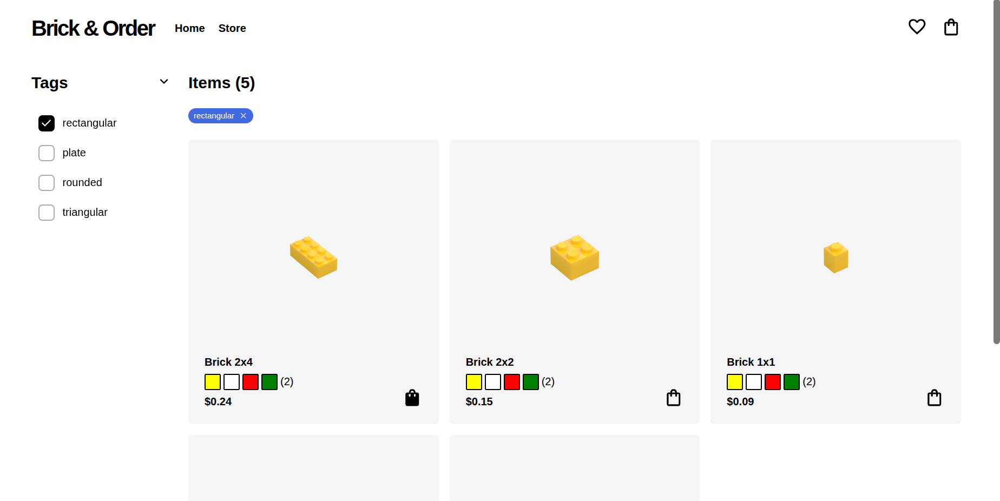
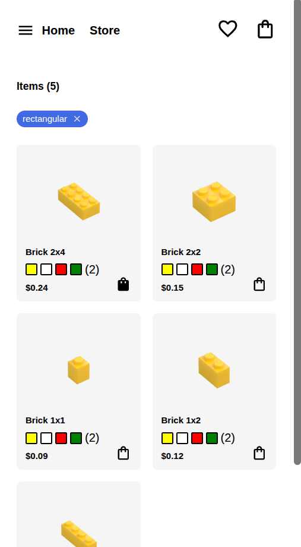

# Brick & Order

Brick & Order is a React e-commerce single-page application for purchasing individual Lego pieces. The app is fully responsive and structured around four client-side routes: a Home page, a Shop page, an Item page (rendered dynamically per item via an item id), and a Cart page.

Each item in the store is modeled as an object carrying its cart state, saved state, and associated tags — keeping the data layer flat and predictable across the application.

## [Live Site](https://bricks-top.netlify.app/)


## Demo 

<p align='center' >
    
</p>

<p align='center' >
    
</p>

## Features

- Item filtering by tags
- Add to cart or favourite next purchases
- Smooth and performant  


## Tech stack

[](https://skillicons.dev)

## Installation

```bash
git clone git@github.com:lmaqungo/shopping-cart.git
cd shopping-cart
npm install
npm run dev
```

## Acknowledgement

- Icons and fonts: [Google fonts](https://fonts.google.com/)
- Design inspiration: [Lego](https://www.lego.com/en-us/pick-and-build/pick-a-brick)
